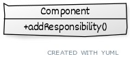
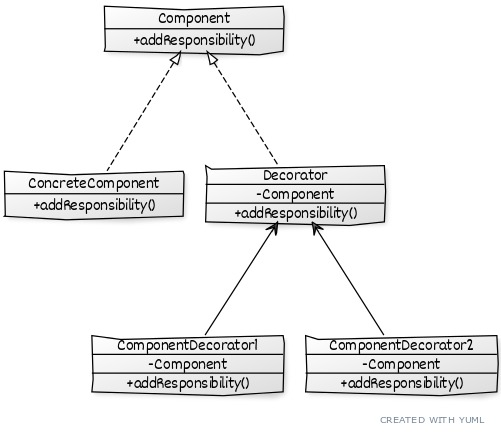

# Decorator

**Type:** Structural.\
**Also known:** Wrapper.\
**Purpose:** Attach new responsibilities to an object dynamically.
***
### What it solves?
* One way to add responsibilities is by inheritance, although this is not flexible.
* To add responsibilities to individual object, not to an entire class.
* We can't control when to **decorate** our objects.
***
### What we need?
**Component:** interface for objects to which we will be adding responsibilities.\
**Concrete Component:** new responsibilities can be attached to this object.\
**Decorator:** abstract class, implements our component and have a component.\
**Concrete Decorator:** implements decorator, here we add responsibilities to a component.
***
### What's it about?
* Enclose a component into a decorator.
* Add unlimited responsibilities to a component
* Decorators can appear anywhere a Component can.
* Decorator may optionally perform additional operations before or after attaching responsibility.
***
### When to use it?
+ When we need to add new responsibilities dynamically without affecting other objects.
+ To add and remove responsibilities.
+ When subclassing is not the best option.
+ To avoid giving support to many independent extensions.
+ Hide or make unavailable actions.
***
### Benefits and liabilities
There are four main benefits and liabilities:
1. **Flexibility** 

    + It's more flexible than static inheritance, since responsibilities are added and removed in dynamically.
    + With different decorator classes for a specific component we can mix and match responsibilities.
    
2. **Feature-Laden**

    + Model *pay-as-you-go* or *add-as-you-need*.
    + We don't need to add lots of complex methods in a complex customizable class. 
    + We can create a Component class and add functionality with Decorators, so the class won't pay for functionality 
    it doesn't use.
    + Extending a complex class can expose and add unnecessary responsibilities.
    
3. **Decorator and Components aren't identical**

    + From an object identity point of view, a decorated component isn't identical to the component itself.
    + We shouldn't rely on object identity when using decorators.
    
4. **Lots of little objects**

    + We will have a system composed of similar little objects.
    + The system is easy to understand by knowing it, but it is hard to lean and debug.
***
### Implementation
1. Define our *Component* class.\

2. Create our *Concrete Component* and *Decorator*, both extending from *Component*
3. Define inside our *Concrete Component* the attributes or storage data we will use.
4. Inside our *Decorator* whe have to declare one *Component* attribute and add the constructor with one argument.\

5. Implement our *Concrete Decorator* by extending from Decorator, when implementing we can add actions 
before or after the responsibility is attached/unattached.\

***
### Considerations    
1. *Interface conformation*. Decorator object's interface must acts as the interface of the component it decorates.
Concrete Decorate classes inherits from a common class.
2. *Omit the Abstract Decorator Class* If we need just one responsibility, we don't need to define an 
Abstract Decorator class.
3. *Keep Component class lightweight*. Components and Decorators must descend from a common Component class, 
which should be kept as lightweight as possible, that's focus on defining an interface not storing data.
4. *Change the skin of an object Vs Change ths guts of an object*. Since the Decorator pattern modifies the outside
of a component, the component doesn't need to know anything about its decorators.
 The decorators are transparent to the components. 
***
### References
* Gamma, E., Helm, R., Johnson, R.,, Vlissides, J. M. (1994). 
*Design Patterns: Elements of Reusable Object-Oriented Software*. Addison-Wesley Professional. ISBN: 0201633612
* [https://yuml.me/diagram/scruffy/class/draw](https://yuml.me/diagram/scruffy/class/draw)